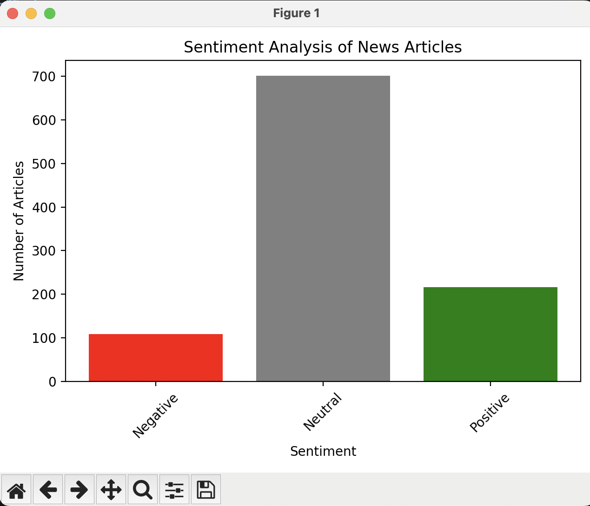

# buzzline-06-stonerogers
Module 6 Project, custom project using producers and consumers 
Melissa Stone Rogers, [GitHub](https://github.com/meldstonerogers/buzzline-06-stonerogers)

## Introduction

This is a professional project creating a custom producer and consumer file. The producer fetches information from [NewsAPI](https://newsapi.org/). The consumer reads this data to an [PostgreSQL](https://www.postgresql.org/download/) database. [pdAdmin 4](https://www.pgadmin.org/download/) was used to view and analyze data, as well as Matplotlib for dynamic visualizations within VS Code. This project will dynamically vizualize the number of articles whose headlines are analyzed to be negative, neutral, or positive.  

Ensure both PostgreSQL and pgAdmin4 are installed on your machine before recreating this project. PgAdmin4 is less important to have installed for use, but I find it easier to view the database tables within the application. Python Version 3.11.6 was used, as well as Git for version control. 

This project references Dr. Case's project repository found [here](https://github.com/denisecase/buzzline-05-case). Much of the detailed instructions in this README.md were borrowed from Dr. Case's project specifications and updated for my machine.
Commands were used on a Mac machine running zsh. 

---
## Task 1. Use Tools from Module 1 and 2

Before starting, ensure you have first completed the setup tasks in [Project 1](https://github.com/denisecase/buzzline-01-case) and [Project 2](https://github.com/denisecase/buzzline-02-case), created by Dr. Case. You will not need Kafka of Zookeeper for this project. 
Python 3.11 is required. 

## Task 2. Copy This Example Project and Rename

Once the tools are installed, copy/fork this project into your GitHub account and create your own version of this project to run and experiment with.
Name it `buzzline-06-yourname` where yourname is something unique to you.
Follow the instructions in [FORK-THIS-REPO.md](https://github.com/denisecase/buzzline-01-case/blob/main/docs/FORK-THIS-REPO.md).

## Task 3. Manage Local Project Virtual Environment

Follow the instructions in [MANAGE-VENV.md](https://github.com/denisecase/buzzline-01-case/blob/main/docs/MANAGE-VENV.md) to:
1. Create your .venv and activate it

Mac/Linux:

```zsh
python3.11 -m venv .venv
source .venv/bin/activate
```

Windows: 

```shell
py -3.11 -m venv .venv
.venv\Scripts\activate
```

2. Install the required dependencies using requirements.txt.

Mac/Linux:

```zsh
python -m pip install --upgrade pip setuptools wheel
python -m pip install --upgrade -r requirements.txt
```

Windows: 

```shell
py -m pip install --upgrade pip setuptools wheel
py -m pip install --upgrade -r requirements.txt
```

Remember, each time a new terminal is opened, activate the .venv. 

Mac/Linux:
```zsh
source .venv/bin/activate
```

Windows:

```shell
source .venv/bin/activate
```

### Initial Project Commit 
Turn on the autosave function in VS Code. Push changes to GitHub freqently to effectively track changes. Update the commit message to a meaningful note for your changes. 
```zsh
git add .
git commit -m "initial"                         
git push origin main
```

## Task 4. Start a New Streaming Application

This will take two more terminals:

1. One to run the producer which writes messages. 
2. Another to run the consumer which reads messages, processes them, and writes them to a database. 

### Producer (Terminal 1) 

Start the producer to generate the messages. 
For configuration details, see the .env file. 

In VS Code, open a NEW terminal.
Use the commands below to activate .venv, and start the producer. 

Mac/Linux:

```zsh
source .venv/bin/activate
python3 -m producers.producer_stonerogers
```

Windows:

```shell
.venv\Scripts\activate
py -m producers.producer_stonerogers
```

### Consumer (Terminal 2)

Start an associated consumer. 
In VS Code, open a NEW terminal in your root project folder. 
Use the commands below to activate .venv, and start the consumer. 

Mac/Linux:

```zsh
source .venv/bin/activate
python3 -m consumers.consumer_nk_stonerogers
```

Windows:

```shell
.venv\Scripts\activate
py -m consumers.consumer_nk_stonerogers
```

## Task 5. Visualizations
If all ran according to plan, you should now visualize something similar to the image below.


The majority of sentiments of titles of top news articles are neutral, with the non-neutral titles being more positive than negative. Additional visualizations could be created by modifying the consumer code to produce additional charts with matlotlib. PgAdmin4 does not have a visualization option within the application, but can be helpful for viewing and adjusting data. 

### Final Project Commit 
Insure all final changes are committed to GitHub.
```zsh
git add .
git commit -m "final"                         
git push origin main
```
---
## Later Work Sessions
When resuming work on this project:
1. Open the folder in VS Code. 
2. Open a terminal to start the producer. Remember to activate your local project virtual environment (.env).
3. Open a terminal to start the consumer. Remember to activate your local project virtual environment (.env).

## Save Space
To save disk space, you can delete the .venv folder when not actively working on this project.
You can always recreate it, activate it, and reinstall the necessary packages later. 
Managing Python virtual environments is a valuable skill. 

## License
This project is licensed under the MIT License as an example project. 
You are encouraged to fork, copy, explore, and modify the code as you like. 
See the [LICENSE](LICENSE.txt) file for more.
